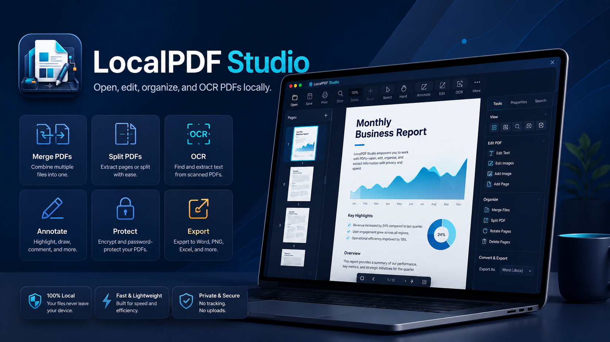

# LocalPDF Studio



<p>
  <a href="https://github.com/jeiel85/localpdf-studio/releases/latest"></a>
  <a href="https://github.com/jeiel85/localpdf-studio/releases"></a>
  <a href="https://github.com/jeiel85/localpdf-studio/blob/master/LICENSE"></a>
  <a href="https://github.com/jeiel85/localpdf-studio/actions/workflows/release.yml"></a>
</p>

<p>
  
  
  
</p>

LocalPDF Studio는 **광고·계정·클라우드 업로드 없이** PDF를 다루는 로컬 우선 데스크톱 앱입니다.
모든 파일 처리는 사용자의 PC 안에서 일어나며, Tauri 2 + React 19 + Rust로 만들었습니다.

**Cross-platform**: Windows · macOS (Apple Silicon + Intel) · Linux. 자세한 설치 방법은 [INSTALL.md](INSTALL.md)를 참고하세요.

🌐 **[GitHub Pages 랜딩 페이지](https://jeiel85.github.io/localpdf-studio/)** · [English](https://jeiel85.github.io/localpdf-studio/en.html) · [日本語](https://jeiel85.github.io/localpdf-studio/ja.html)

---

## 📥 다운로드

[**최신 릴리즈**](https://github.com/jeiel85/localpdf-studio/releases/latest)에서 OS별 산출물을 받을 수 있습니다.

| 플랫폼 | 산출물 | 설치 방법 |
|---|---|---|
|  **Windows 10+** | NSIS `.exe` · MSI · Portable ZIP | 더블 클릭 · winget · Chocolatey |
|  **macOS 10.15+** ⚠️ 무서명 | Universal DMG (M1+Intel) | DMG 마운트 → Applications → 우클릭 열기 |
|  **Linux** | AppImage · `.deb` · `.rpm` | 배포판별 패키지 또는 AppImage 직접 실행 |

### 패키지 매니저로 설치

| 매니저 | 명령어 | 상태 |
|---|---|---|
|  **winget** | `winget install jeiel85.LocalPDFStudio` | 매니페스트 작성 완료, microsoft/winget-pkgs PR 예정 |
|  **Chocolatey** | `choco install localpdf-studio` | 패키지 작성 완료, community 큐 제출 예정 |
|  **Snap** | `sudo snap install localpdf-studio` | snapcraft.yaml 준비, 등록 예정 |
|  **AUR** | `yay -S localpdf-studio-bin` | PKGBUILD 준비, 등록 예정 |
|  **Homebrew** | `brew tap jeiel85/tap && brew install --cask localpdf-studio` | Cask 작성 완료, personal tap 우선 |

> macOS 빌드는 현재 Apple Developer 서명/공증이 없습니다 ($99/년 비용 부담). 첫 실행 시 Gatekeeper 우회가 필요합니다 — 절차는 [INSTALL.md#macOS](INSTALL.md#macos) 참고. 사용자가 의미 있게 늘면 서명 도입 검토 예정.

---

## ✨ 핵심 방향

- **로컬 우선** — PDF 내용은 외부 서버로 전송하지 않습니다.
- **Cross-platform** — Windows / macOS / Linux 단일 코드베이스 (Tauri 2 + React).
- **빠른 데스크톱 UI** — ~15MB 설치 크기, 메인 JS 번들 117KB.
- **완성된 PDF 워크플로** — 뷰어부터 OCR · 폼 채우기 · 분할 비교까지 한 앱에서.
- **다국어** — 한국어 · 영어 · 일본어 (브라우저 언어 자동 감지).
- **배포 자동화** — GitHub Actions 3-OS 매트릭스, Tauri updater 서명 자동 업데이트.

---

## 🚀 기능 (v0.15.0)

### 📖 PDF 뷰어
- PDF.js 기반 고성능 렌더링 — 단일 페이지 / 연속 스크롤
- 페이지 맞춤 3종 (너비 / 페이지 / 실제 크기) + 확대 · 회전 · 텍스트 선택
- 대용량 PDF (250MB+) 스트리밍 로드 (`pdf-local://` 커스텀 프로토콜 + HTTP Range)
- 렌더 큐로 메인 스레드 보호, 가시 영역 외 페이지 자동 메모리 해제
- 페이지 썸네일 / 목차 / 전문 검색 (캔버스 하이라이트) / 최근 문서
- 다중 문서 탭 + 세션 복원 (페이지/배율/회전/레이아웃 모두 복원)
- 파일 드래그앤드롭 · Windows 우클릭 메뉴

### ✒️ 주석 및 보안 마스킹 (v0.15.0 New!)
- **개인정보 자동 탐지 및 마스킹 추천** — 주민등록번호, 휴대전화번호, 이메일, 신용카드 번호, 계좌번호, 사업자등록번호, 여권번호, 운전면허번호를 PDF 텍스트 레이어에서 100% 로컬로 스캔하고 추천 마스킹 영역으로 변환
  - **정밀 부분 문자열 좌표 환산**: PDF.js `TextItem`의 `transform`/`width` 정보를 바탕으로 개인정보가 문장 일부에만 포함된 경우에도 문자 비례 너비(`charWidth`)로 밀착 좌표를 산출.
  - **분산 텍스트 통합 탐지**: 이메일처럼 여러 TextItem에 쪼개진 패턴도 전체 인덱스 매핑으로 이어 붙여 탐지하고, 페이지별 `RedactionArea`로 병합.
  - **프라이버시 보호 결과 UI**: 탐지 결과는 `*` 마스킹 표시와 유형별 배지로 보여주며, 전체/개별 선택 후 기존 블랙아웃 마스킹 목록에 추가. 스캔 이미지 PDF는 OCR → 검색 가능 PDF 안내를 제공.
  - **적용 전 안전 확인 및 되돌리기**: 래스터/벡터 마스킹의 보안 차이를 적용 직전에 고지하고, 자동 탐지로 방금 추가한 영역은 즉시 되돌릴 수 있음.
- **개인정보 보안 마스킹 (블랙아웃)** — 100% 오프라인 로컬 처리
  - **영구 래스터화 마스킹 (Secure Rasterization)**: 대상 페이지를 300DPI 고해상도로 렌더링하고 마스킹 영역을 검은색으로 완전히 칠한 뒤 신규 이미지 페이지로 원자적 교체 (`insertPage` & `removePage` 전략). 기존의 원본 텍스트 레이어, 벡터 그래픽스 및 메타데이터를 영구 파괴하여 백그라운드 드래그나 데이터 마이닝을 통한 개인정보 유출을 원천 방지!
  - **일반 벡터 마스킹**: pdf-lib `drawRectangle` API를 활용하여 검은색 사각형 영역을 PDF 위에 빠르게 덧그림.
  - **정교한 화면 변환 UI**: 확대/축소 및 페이지 회전(0/90/180/270도) 상태에 완벽 대응하여 흔들림 없이 밀착 고정되는 드래그 영역 지정 박스 및 삭제 호버 애니메이션 버튼.
  - **간섭 방지**: 드래그 마스킹 모드 진입 시 브라우저 텍스트 선택 기능과의 충돌을 억제하기 위해 `.textLayer`와 `.annotationLayer` 선택을 원천 차단.
- **다중 페이지 텍스트 선택 하이라이트** — **국제 표준 Highlight Annotation** 연동
  - PDF.js 텍스트 레이어와 `window.getSelection()`을 유기적으로 연동하여 자연스럽게 여러 페이지를 넘나드는 다중 줄 하이라이트 지정.
  - `pdf-lib` 저수준 API를 사용하여 각 페이지의 `/Annots` 딕셔너리에 표준 Highlight Annotation 객체를 임베딩함으로써, **Adobe Acrobat, Chrome 내장 뷰어, macOS Preview 등 타 리더기 주석 패널과의 완벽한 양방향 호환성** 확보.
  - 0°, 90°, 180°, 270° 모든 회전 각도를 수학적으로 연산하는 역변환 보정 공식을 적용하여 완벽하게 정렬된 하이라이트 렌더링 제공.

### 🛠️ PDF 작업 엔진 (qpdf 기반)
- 병합 / 분할 (페이지 단위 개별 파일)
- 페이지 추출 (범위 지정: `1-5, 7, 10-12`)
- 페이지 회전 — 전체/범위 또는 페이지 편집기에서 인라인 회전
- 페이지 재정렬 / 삭제 / 다른 PDF 삽입 (드래그앤드롭 편집기)
- 암호 설정/해제 (256-bit AES, `--password-file`로 CLI 노출 방지)
- 압축 / PDF 정규화 (linearize + object stream)
- 메타데이터 읽기 + **편집** (Title/Author/Subject/Keywords)

### 🔍 OCR / 변환 / 고급 기능
- **Tesseract OCR** — 언어 선택, DPI 설정, 텍스트 추출
- **검색 가능 PDF 생성** — 스캔 PDF를 텍스트 레이어 합성된 PDF로 변환
- **이미지 OCR** — PNG / JPG / WEBP / BMP / TIFF에서 텍스트 추출
- PDF → 이미지 (PNG / JPEG / WebP), PDF → TXT, 이미지 → PDF
- 워터마크 / 스탬프 (qpdf overlay/underlay)
- **분할 뷰 비교** — 두 PDF 좌/우 동시 표시 + 페이지별 텍스트 차이 분석
- **PDF 폼 채우기** — AcroForm 텍스트/체크/드롭다운/라디오 필드 편집
- **책갈피** — PDF별 로컬 저장 (원본 미수정)

### ⚙️ 외부 도구 자동 설치
- qpdf, Tesseract를 앱에서 자동 다운로드/설치
- **SHA-256 무결성 검증** 통과해야만 실행 (네트워크 변조 차단)
- Tesseract 설치는 UAC 권한 승격 안내

### 🎨 UI / UX
- 다크 / 라이트 / 시스템 테마 자동 연동
- 한국어 / 영어 / 일본어 (`react useLocale` 훅으로 즉시 전환)
- 키보드 단축키 25+ (`Ctrl+O/F/B/G/L/P/+/-/0`, `Home/End`, `Alt+←→`, `F1`)
- 설정 패널 20+ 옵션 (자동 저장)
- 인쇄 다이얼로그 (전체/현재/지정 페이지)

### 🔒 보안
- **CSP 활성화** — `default-src 'self'`, `object-src 'none'`
- 모든 PDF 명령 진입 경로 검증 (시스템 디렉터리 출력 차단)
- PDF.js `isEvalSupported: false` — 악성 PDF 임베디드 JS 차단
- JSON 파일 atomic write (recent_files / tab_state / settings)
- `pdf-local://` 프로토콜 CORS 화이트리스트
- 자동 설치 SHA-256 검증, 임시 비밀번호 파일 UUID v4 + `0o600`

### 📦 배포
- NSIS / MSI(ko-KR/en-US) / Portable ZIP — Windows
- Universal DMG / .app — macOS (Apple Silicon + Intel)
- AppImage / .deb / .rpm — Linux
- **Tauri updater** 서명 검증 자동 업데이트
- GitHub Actions 3-OS 매트릭스 빌드

---

## 🧰 기술 스택

<p>
  
  
  
  
  
  
  
</p>

```text
Desktop Shell : Tauri 2
Frontend      : React 19 + TypeScript 5 + Vite 7
Backend       : Rust (edition 2021) — chrono, sha2, uuid, base64, which
PDF Viewer    : PDF.js (pdfjs-dist v5) + TextLayer
PDF Engine    : qpdf CLI wrapper (--password-file 안전 모드)
OCR           : Tesseract CLI wrapper (searchable PDF / 이미지 OCR)
Image/PDF     : pdf-lib (JS), Canvas API
Bundler       : Tauri NSIS / MSI / DMG / AppImage / deb / rpm
Updater       : Tauri updater plugin (minisign)
Test          : Vitest (41 tests), Rust #[test] (37 tests)
CI/CD         : GitHub Actions 3-OS matrix
```

---

## 🏃 빠른 시작 (개발)

### 요구 사항

- **Node.js LTS** (22+)
- **Rust stable**
- **OS별 추가 의존성**
  - Windows: Microsoft Edge WebView2 Runtime, (선택) WiX Toolset v3 for MSI
  - macOS: Xcode Command Line Tools
  - Linux: `libwebkit2gtk-4.1-dev libgtk-3-0-dev libayatana-appindicator3-dev librsvg2-dev patchelf`

### 설치 & 실행

```bash
npm install
npm run tauri:dev      # 개발 모드
```

### 정적 검사 / 빌드

```bash
npm run typecheck      # TypeScript 타입 체크
npm run test           # Vitest 단위 테스트
npm run build          # 프론트엔드 빌드
npm run tauri:build    # 데스크톱 앱 빌드 (현재 OS)
```

### Windows 우클릭 메뉴 (개발 시)

```powershell
powershell -ExecutionPolicy Bypass -File scripts/windows/install-context-menu.ps1 `
  -ExePath "$PWD\src-tauri\target\release\localpdf-studio.exe"
# 해제
powershell -ExecutionPolicy Bypass -File scripts/windows/uninstall-context-menu.ps1
```

---

## 📂 저장소 구조

```text
src/                         React UI (components, lib, i18n, App, types)
src-tauri/                   Rust/Tauri backend (commands, qpdf, ocr, watermark, ...)
scripts/windows/             Windows 우클릭 메뉴 + Portable ZIP 생성 스크립트
docs/                        제품/기술/배포 설계 문서 + GitHub Pages 랜딩
packaging/                   패키지 매니저 매니페스트
  ├── winget/                  Windows winget
  ├── chocolatey/              Windows Chocolatey
  ├── homebrew/                macOS Homebrew Cask
  ├── snap/                    Linux Snap
  └── aur/                     Linux AUR
e2e/                         Playwright + Tauri WebDriver (스캐폴드)
.github/workflows/           CI / release workflow (3-OS matrix)
```

---

## 📋 릴리즈 정책

- 버전 형식: SemVer `vX.Y.Z`
- 산출물:
  - **Windows**: `setup.exe` + `.sig`, `.msi` (ko/en), portable `.zip`, `latest.json`
  - **macOS**: Universal `.dmg`, `.app`
  - **Linux**: `.AppImage`, `.deb`, `.rpm`
- 태그 푸시(`v*.*.*`) 기준 [GitHub Actions](https://github.com/jeiel85/localpdf-studio/actions) 3-OS 매트릭스 자동 빌드
- Tauri updater 서명 검증을 전제로 한 자동 업데이트

---

## 📜 라이선스

[Apache-2.0](LICENSE).

외부 바이너리 (qpdf, Tesseract) 및 라이브러리는 [docs/05_SECURITY_PRIVACY_LICENSE.md](docs/05_SECURITY_PRIVACY_LICENSE.md) 기준으로 라이선스 호환성을 검토합니다.

---

<p align="center">
  <a href="https://github.com/jeiel85/localpdf-studio/releases/latest"><b>최신 다운로드 →</b></a>
  ·
  <a href="https://jeiel85.github.io/localpdf-studio/">랜딩</a>
  ·
  <a href="https://github.com/jeiel85/localpdf-studio/issues">이슈</a>
  ·
  <a href="CHANGELOG.md">변경 이력</a>
</p>
